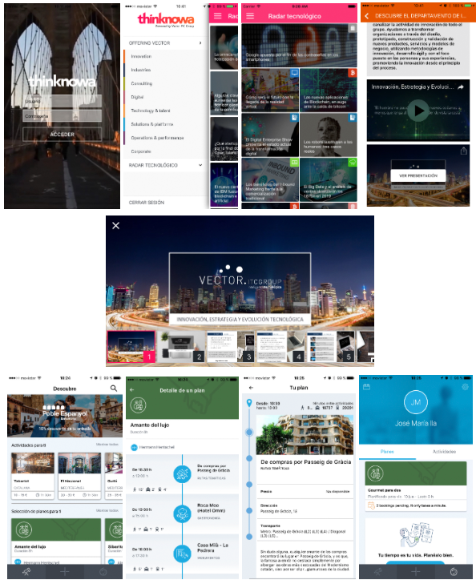
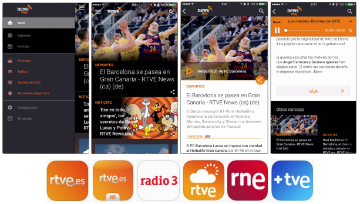

#  José María Ila Contreras  

**Ingeniero Informático** especializado en el desarrollo de aplicaciones móviles para iOS.

* **Lenguajes de programación**: Objective-c, Swift, Java, C, C++, PHP.
* **Movilidad**: iOS, React Native.
* **Java**: Java SE, Java EE (JSP, Servlets, Struts).
* **Web**: HTML+CSS, Javascript, jQuery, XML, JSON.
* **Bases de datos**: MySQL, Realm.
* **Control de versiones**: Git, SVN.
* **Otras herramientas**: Xcode, Eclipse, Netbeans, Bitbucket, JIRA, Unity3D, Cocos2D, Cocos2D-X.

## Experiencia laboral

### **Vector ITC Group**, Madrid.

* **Analista Programador / Programador Senior iOS.**
* *Marzo 2016 - Actualidad.*
* Desde marzo de 2016 desempeño mi labor dentro del [departamento de movilidad](http://vectoritcgroup.com/es/vector-mobile).
* **Proyectos destacados:**
	* Mantenimiento, soporte y desarrollo de aplicación turística de la ciudad de Barcelona: **WeGo|BCN**.
	* Desarrollo de aplicación para **Best Day**: [BDTravel]().
	* Desarrollo de aplicaciones corporativas de **Vector Mobile**: [Radar tecnológico](https://itunes.apple.com/ie/app/radar-tecnologico/id1119531453?mt=8).
		
		
		
### **Planet Media Studios**, Madrid.

* **Analista Programador / Programador iOS.**
* *Agosto 2015 - Marzo 2016.*
* Desde agosto de 2015 a marzo de 2016 desempeñé mi labor en **RTVE** formando parte del equipo de movilidad desarrollando aplicaciones para dispositivos iOS. Algunas de las aplicaciones en las que trabajé fueron: [RTVE news](https://itunes.apple.com/es/app/rtve-news/id1038065939?mt=8), [RTVE Móvil](https://itunes.apple.com/es/app/rtve.es-movil/id344472880?mt=8), [RTVE a la carta](https://itunes.apple.com/es/app/rtve-a-la-carta/id481097328?mt=8), [RNE](https://itunes.apple.com/es/app/radio-nacional-de-espana/id320731278?mt=8), [El Tiempo de RTVE](https://itunes.apple.com/es/app/el-tiempo-en-rtve.es/id516309057?mt=8), [Radio 3](https://itunes.apple.com/es/app/radio-3/id698721349?mt=8) y [+TVE](https://itunes.apple.com/es/app/+tve-rtve.es/id695449936?mt=8).
* **Proyectos destacados**:
	* Mantenimiento y soporte de las aplicaciones de RTVE publicadas en [AppStore](https://itunes.apple.com/es/developer/corporacion-rtve/id320731281).
	* Mantenimiento e implementación de módulos privados para [Cocoapods](https://cocoapods.org).
	* Colaboración en todo el proceso de desarrollo de [RTVE news](https://itunes.apple.com/es/app/rtve-news/id1038065939?mt=8).

		

### **Enala**, Madrid.

* **Programador Junior / Programador iOS.**
* *Julio 2013 - Febrero 2015.*
* Programador dedicado al desarrollo de aplicaciones móviles para dispositivos iOS y aplicaciones web.
* **Proyectos destacados:**
	* Mantenimiento, soporte y desarrollo de conjunto de aplicaciones turísticas para [App Ciudad](https://itunes.apple.com/es/developer/clever-work-system/id523047802).
	* Desarrollo de videojuego de cartas online [Pochalive](https://itunes.apple.com/es/app/pochalive-gran-juego-la-pocha/id880029934).
	* Desarrollo de aplicación para el **Ministerio de Defensa**: [Revistas de Defensa](https://itunes.apple.com/es/app/revistas-de-defensa/id771844338).
	* Mantenimiento, soporte y desarrollo de aplicaciones para **RACE** asistencia en carretera: [GE Capital Asistencia](https://itunes.apple.com/es/app/id863023123), [Génesis Asistencia](https://itunes.apple.com/es/app/id918453112).

		 

### **Enala**, Jaén.

* **Becario de prácticas de empresa.**
* *Enero 2013 - Julio 2013.*
* Prácticas de empresa a través del programa Ícaro de la Universidad de Jaén durante el primer semestre de 2013.
* **Proyectos destacados:**
	* Mantenimiento, soporte y desarrollo de portal [Cinfa formación](http://www.cinfaformacion.com).
	* Mantenimiento y soporte de conjunto de aplicaciones turísticas para [App Ciudad](https://itunes.apple.com/es/developer/clever-work-system/id523047802).

### **Universidad de Jaén**, Jaén.

* **Becario de colaboración informática.**
* *Octubre 2011 - Julio 2012.*
* Beca de colaboración informática para el apoyo a Centros y al Vicerrectorado de docencia y profesorado durante el curso académico 2011/12. Beca realizada en la [Escuela Politécnica Superior de Jaén](http://eps.ujaen.es).

## Formación académica

### **Ingeniería Informática**, 2015.

* **Universidad de Jaén**.
* Especialidad en Informática Gráfica y Procesamiento de Imágenes (*IGI*).
* **Proyecto Fin de Carrera:**
	* **Modelado de ciudades para dispositivos iOS**.
	* Enero 2015 - Junio 2015.
	* Desarrollo de un sistema con capacidades asociadas a un *GIS*, que visualiza e interactua con elementos urbanos de la ciudad de Jaén así como localiza empresas y obtiene información sobre ellas. El sistema consiste en una aplicación web que gestiona la información empresarial y una aplicación móvil para dispositivos iOS.

		

### **Ingeniería Técnica en Informática de Gestión**, 2010.

* **Universidad de Jaén**.

## Formación complementaria

* **Agilidad y Lean. Gestionando los proyectos y negocios del s. XXI**, 2014.
	* Universidad Rey Juan Carlos, Madrid.
	* 50 horas.

* **XXII Congreso Español de Informática Gráfica (CEIG 2012)**, 2012.
	* Universidad de Jaén, Jaén.
	* 30 horas.

* **Redes sociales: Una oportunidad para el emprendimiento y la empleabilidad**, 2012.
	* Universidad de Jaén, La Carolina.
	* 30 horas.

* **La protección de los datos de carácter personal**, 2009.
	* Universidad de Murcia, Murcia.
	* 202 horas.

* **Trabajando en TIC**, 2008.
	* Universidad de Jaén, La Carolina.
	* 30 horas.  

## Licencia

	The MIT License (MIT)

	Copyright (c) 2016 José María Ila

	Permission is hereby granted, free of charge, to any person obtaining a copy
	of this software and associated documentation files (the "Software"), to deal
	in the Software without restriction, including without limitation the rights
	to use, copy, modify, merge, publish, distribute, sublicense, and/or sell
	copies of the Software, and to permit persons to whom the Software is
	furnished to do so, subject to the following conditions:

	The above copyright notice and this permission notice shall be included in all
	copies or substantial portions of the Software.

	THE SOFTWARE IS PROVIDED "AS IS", WITHOUT WARRANTY OF ANY KIND, EXPRESS OR
	IMPLIED, INCLUDING BUT NOT LIMITED TO THE WARRANTIES OF MERCHANTABILITY,
	FITNESS FOR A PARTICULAR PURPOSE AND NONINFRINGEMENT. IN NO EVENT SHALL THE
	AUTHORS OR COPYRIGHT HOLDERS BE LIABLE FOR ANY CLAIM, DAMAGES OR OTHER
	LIABILITY, WHETHER IN AN ACTION OF CONTRACT, TORT OR OTHERWISE, ARISING FROM,
	OUT OF OR IN CONNECTION WITH THE SOFTWARE OR THE USE OR OTHER DEALINGS IN THE
	SOFTWARE. 	  
